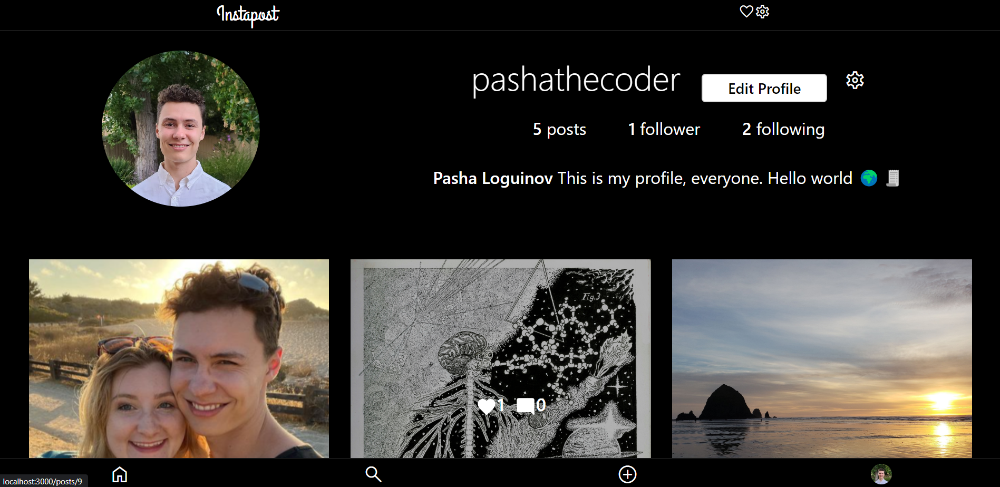

# Instapost (An Instagram Clone)

## Description: 

This application is a responsive React front end for my [Instapost API](https://github.com/pasha-log/capstone2-backend), which works together to create a social media website where users can share, like, and comment on photos. Users can search for other users and follow them, and stay up to date with posts that their friends have created. 

This project was bootstrapped with [Create React App](https://github.com/facebook/create-react-app). This project uses [Bootstrap 5](https://getbootstrap.com/) and [react-strap](https://github.com/reactstrap/reactstrap) components for much of its CSS, as well as [Material UI](https://mui.com/material-ui/getting-started/overview/) and the [CSS Flex Grid System](https://css-tricks.com/snippets/css/a-guide-to-flexbox/). And I combined reactstrap elements with [React Hook Form](https://react-hook-form.com/get-started/) for all of my form components. Client side routing is handled by [react-router-dom v6](https://www.npmjs.com/package/react-router-dom) and HTTP requests for AJAX functionality is done using the [Axios](https://github.com/axios/axios) library. The backend API was written in Node using the Express web framework and a PostgreSQL database. Users upload photos with the help of Amazon's S3 Bucket webservice which allows for efficient image storage.

## Tools Used: 

* [React.js](https://reactjs.org/)
* [Reactstrap](https://reactstrap.github.io/?path=/docs/home-installation--page)
* [React Hook Form](https://react-hook-form.com/get-started/)
* [Material UI](https://mui.com/material-ui/getting-started/overview/)
* [Amazon S3](https://aws.amazon.com/s3/)
* [React Easy Crop](https://github.com/ValentinH/react-easy-crop)

## Installation
After cloning the repository, install all dependencies by executing `npm install` within the top level project directory. This program requires the use of an external API to function.

If you wish to run this API locally on your machine, see my [repository for the Instapost API](https://github.com/pasha-log/capstone2-backend) for installation instructions and more info. This app expects the Instapost API to be listening on **port 3001** of localhost; make sure to change the port number of the localhost URL in `Api.js` if your local deployment of the API is listening on a different port. With your local API set up, start this app in developer mode with the following command:
### `npm start`